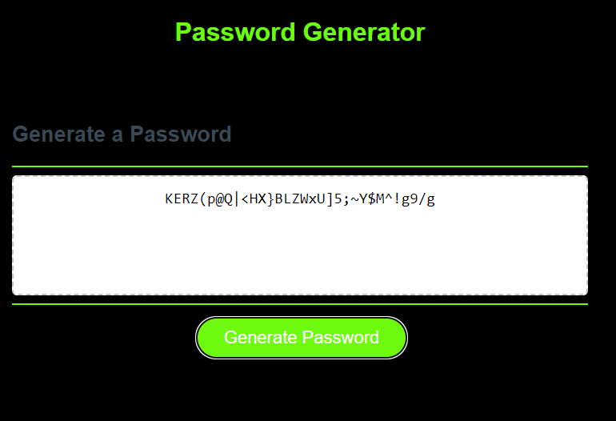
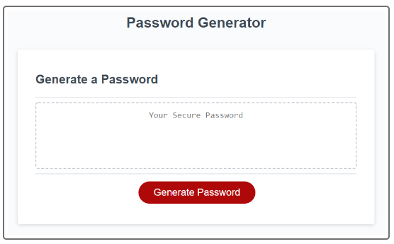

# Password Generator Starter Code

#URL
https://bgayk.github.io/PasswordGenerator/

# Usage
Application will allow a user to create a randomly generated password from 8-128 characters 

Output is based on the user selecting at least one character type of: Numeric, Special Characters,
UpperCase Characters, and/or lower case characters. 

The special character list is based on the string list provided by the OWASP org 
at: https://owasp.org/www-community/password-special-characters

Application will verify that the generated password contains at least one of the
selected character types. During verification if the password fails verification, the 
application will try generating another one up to 1000 times. An error message will alert the
user to try again if the retry limit is met.

## Completed App Image - Modified to a darker theme

## 
## Mockup Image
